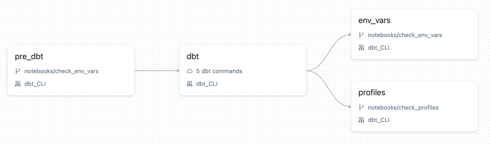

# dbt-databricks-demo

## Prerequisites

    - pyenv + poetry

## How to use it
Create virtual environment with dependencies needed for testing dbt in locally.

```sh 
poetry install
```

Only if creating new project, skip otherwise:
```sh
poetry run dbt init
```

Follow the prompts and select required options to build your dbt project.
You'll be required to setup your ~/.dbt/profiles.yml - file contains credentials for your Databricks SQL warehouse connection.


If your project already exists and your ~/.dbt/profiles.yml file has been configured you can execute dbt commands against selected profile.

```sh
cd demo && poetry run dbt debug
```

-----
To create a workflow that captures these settings, make sure you have updated demo.json with respective value for fields like <YOUR_CATALOG_NAME> etc.
Make sure you have databricks-cli configured and create a new workflow as follows:
```sh
databricks --profile <profile_name> job create --json-file workflows/demo.json
```

--- 
There are 3 sample workflows to test different ways of interacting with databricks-dbt workflows:

1. with default dbt profiles (generated by dbt task)
2. with custom dbt profile where token saved in DBT_ACCESS_TOKEN env var
3. with custom dbt profile where token saved in PAT_TOKEN env var

----

Description of tasks:

1. pre_dbt task checks current state of env vars:
> Please note it is not the best practice to set a token as an env var, this is only for debugging purposes.
2. dbt task runs the dbt commands
3. env_vars checks the current state of env vars
4. check_profiles task to verify what the dbt profiles looks like
